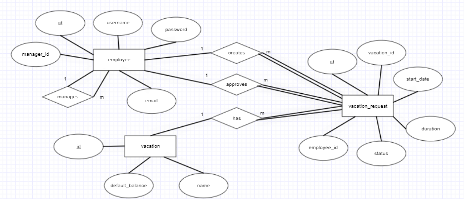

# Vacation Tracking System

## 1. Requirements

### 1.1. Vision

A **Vacation Tracking System** (VTS) will provide individual employees with the
capability to manage their own **vacation time**, **sick leave**, and **personal time off**, without having to be an expert in company policy or the local facility’s leave policies.

The main goal of this application is to **improve the internal business processes** of this organization, at least with respect to the time it takes to **manage vacation time requests**.

### 1.2. Functional Requirements

+ Implements a flexible **rules-based system** for validating and verifying leave time requests.

+ Enables **manager approval**.

+ Provides **access to requests** for the previous calendar year, and allows requests to be made up to a year and a half in the future.

+ Uses **e-mail notification** to request manager approval and notify employees of request status changes.

+ Uses existing hardware and middleware.

+ Is implemented as an extension to the **existing intranet portal system**, and
uses the **portal’s single-sign-on mechanisms** for all authentication.

+ Keeps **activity logs** for all transactions.

+ Enables the HR and system administration personnel to **override all actions restricted by rules**, with logging of those overrides.

+ Allows managers to **directly award personal leave time** (with system-set limits).

+ Provides a **Web service interface** for other internal systems to query any given employee’s vacation request summary.

+ Interfaces with the **HR department legacy systems** to retrieve required employee information and changes.

### 1.3. Non-Functional Requirements

+ The system should be **user-friendly** to ensure that employees and managers can use it without extensive training.

+ The system must ensure **secure handling** of employee data, especially given its integration with HR systems.

+ The system should comply with **organizational policies** and possibly legal regulations concerning employee data management.

### 1.4. Constraints

+ Use of Existing Hardware and Middleware.
+ Integration with Existing Intranet Portal System.
+ Compliance with Organizational Policies.
+ Interface with HR department legacy systems to retrieve required employee information and changes.

## 2. Domain

In the past, all vacation time had to be approved by an immediate manager and then checked by a clerk in the HR department before it was authorized. Sometimes this manual process could **take days**.

An **automated system** will speed up this process and will require at most **one manual approval** by the immediate manager (some high-level employees may not require manager approval).

This system has the potential to **save time and money** mostly in the HR department, which is essentially taken out of the individual time request process and replaced by a **rules-based validation system**. HR personnel are still responsible for entering and updating employee vacation data in the system; however, they will no longer be a link in the chain for requesting and validating each time request.

## 3. Actors

+ **Manager**

> An employee who has all the abilities and goals of a regular employee, but with the added responsibility of approving vacation requests for immediate subordinates. A manager may award subordinates comp time, subject to certain limits set in the system.

+ **Clerk**

> A member of the HR department who has sufficient rights to view employees’ personal data and is responsible for ensuring that employees’ information in all HR systems is up to date and correct. An HR clerk can add or remove nearly any record in the system. In the real world, HR clerks may or may not be employees; however, if they are employees, they use two separate login IDs to manage these two different roles.

+ **Employee**

> The main user of this system. An employee uses this system to manage his or her vacation time.

+ **System Admin**

> A role responsible for the smooth running of the system’s technical resources (e.g., Web server, database) and for collecting and archiving all log files.

## 4. Use Cases

+ **Manage Time**

> Describes how employees request and view vacation time
requests.

+ **Approve Request**

> Describes how a manager responds to a subordinate’s
request for vacation time.

+ **Award Time**

> Describes how a manager can award a subordinate extra
leave time (comp time).

+ **Edit Employee Record**

> Describes how an HR clerk edits an employee’s information in the system. This includes setting all the leave time allowances and the maximum time that can be awarded by the manager.

+ **Manage Locations**

> Describes how an HR clerk manages location records and their rules.

+ **Manage Leave Categories**

> Describes how an HR clerk manages leave categories and their rules.

+ **Override Leave Records**

> Describes how an HR clerk may override any rejection of leave time requests made by the rules in the system.

+ **Back Up System Logs**

> Describes how the system administrator backs up the system’s logs.

### 4.1. Manage Time Use Case

#### 4.1.1. Sequence Diagram

#### 4.1.2. Flow Chart

### 4.2. Withdraw Request Use Case

#### 4.2.1. Sequence Diagram

### 4.3. Cancel Request Use Case

#### 4.3.1. Sequence Diagram

## 5. ERD

